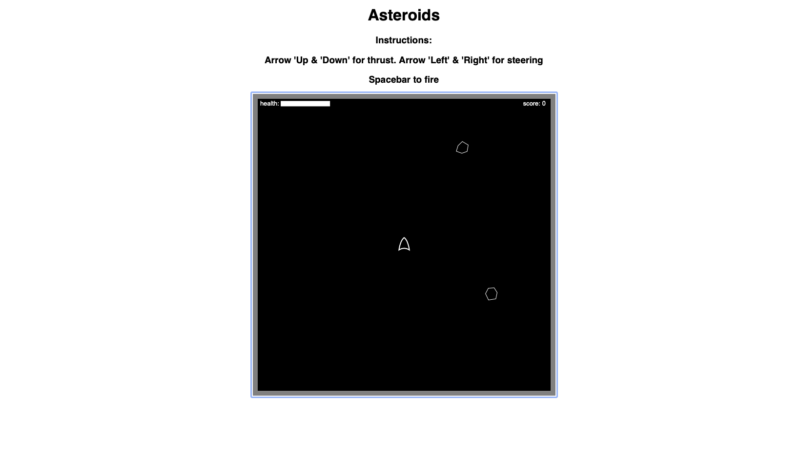

## Table of contents

-   [General info](#general-info)
-   [Link](#asteroids-link)
-   [MVP](#MVP)
-   [Future functionality](#future-functionality)
-   [Screenshots](#screenshots)
-   [In-depth Features of Task Time Boxer](#in-depth-features)
-   [Challenges](#challenges)
-   [Technologies Used](#technologies-used)
-   [Download](#download)

## General info

A clone of the asteroids game.

It was developed by using a HTML GAme development book where i wanted to learn more about HTML Canvas, Frame Animation with basic Object Oriented principles.

It also provided some key learnings in how calculations are performed to measure distance, angles, motion to game entities. Specifcally, have an appreciation how physics plays a part in game development.

## Asteroids Link

-   The link to his website is:
    [https://mistergjones.github.io/asteroids/]

## MVP

The following were the key requirements in meeting the Asteroids game.

-   Learn HTML Canvas, Frame animation, Javascript with OO principles.
-   Implement the use of key handler events to capture the player controls. (e.g. up arrow, down arrow etc)
-   Learn and understand how the calculation of angles, motion

## Future Functionality

Future functionality can incorporate the following:

-   Increase the size of the asteroids to be bigger
-   Increase the number of asteroids once you have cleared the screen.

## Screenshots

## In depth Features

-   HTML and Javasceript.
-   Object Oriented principles with inheritance.
-   Use of sin(), cos() and atan() to help with angles and distance.

## Challenges

-   Understanding OO principles and how they are applied.
-   Understanding how physics in the "real world" are developed and applied within a game.

## Technologies Used

Project is created with:

-   Javascript.
-   HTML.
-   Git/Github (for version control).
-   Github pages (for hosting)

## Download

Download via:

-   https://github.com/mistergjones/asteroids.git
